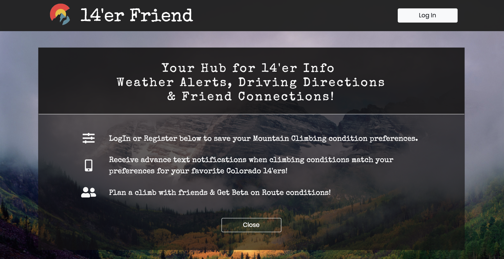
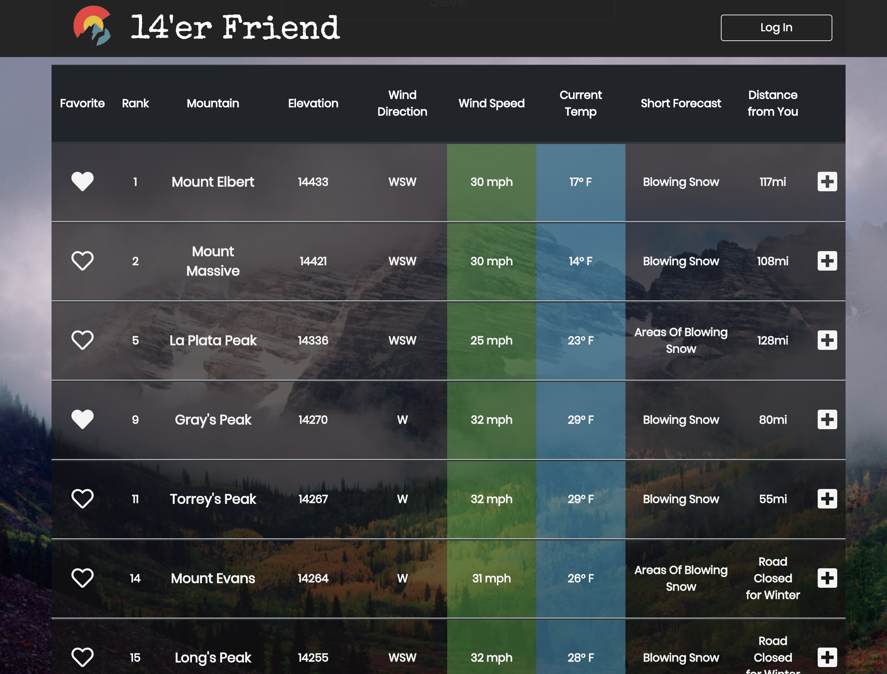
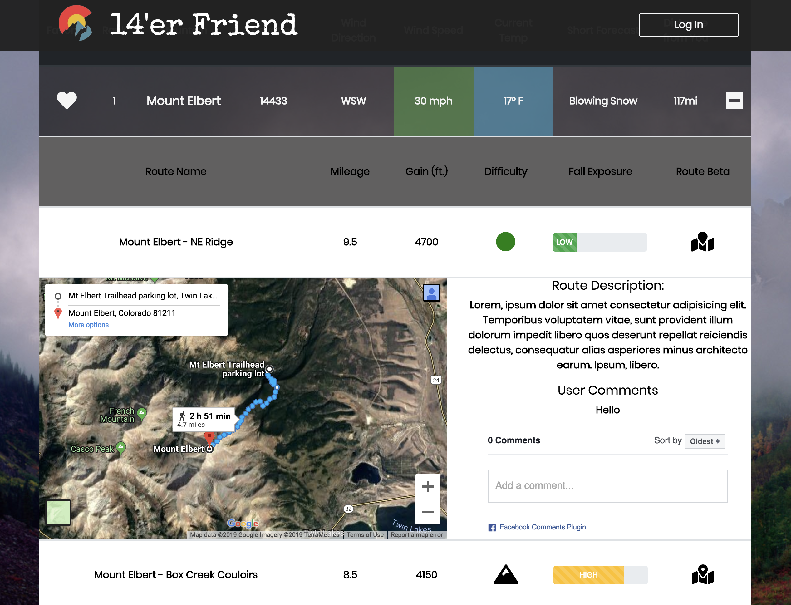
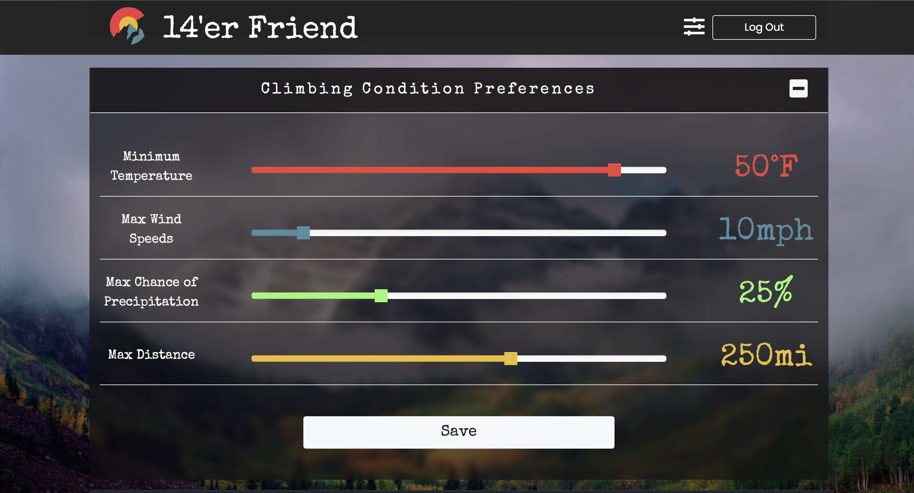
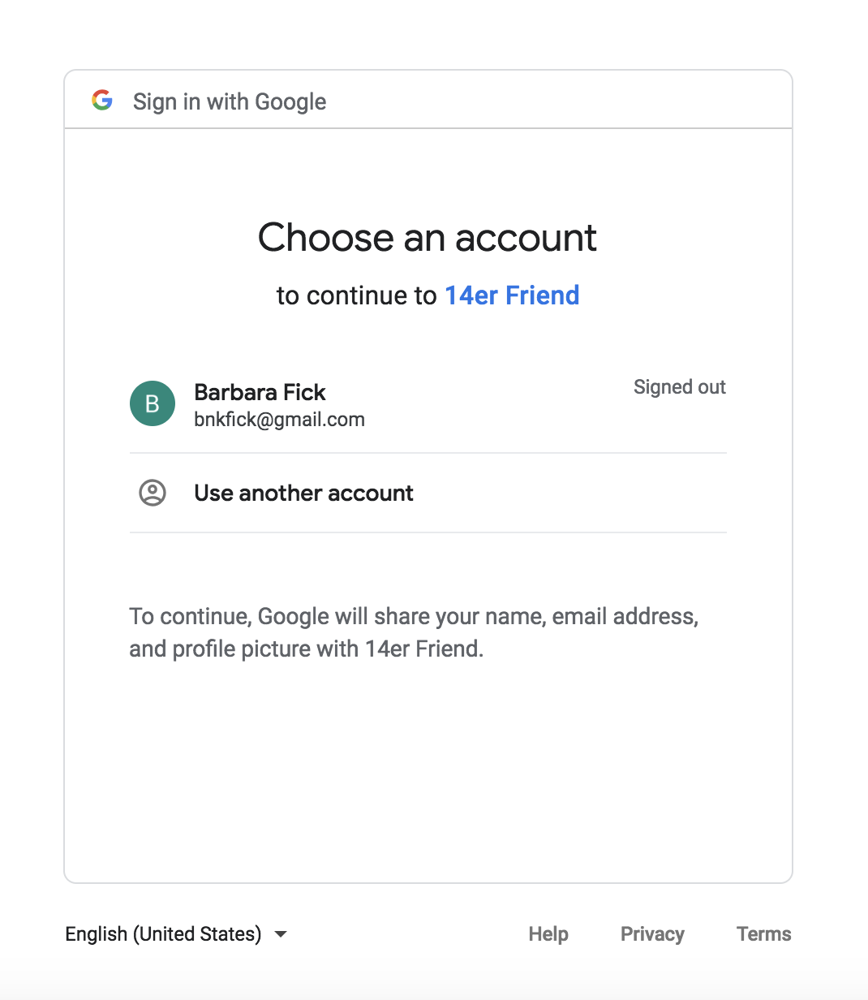
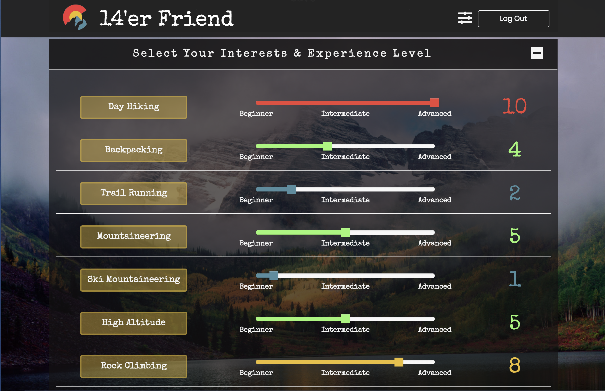

# 14er Friend

## Live Site
- https://fourteener-friend.herokuapp.com

## Target Audience
 * Anyone who wants to start tackling the front range fourteeners &mdash; from beginners to avid climbers.

## What is the problem that the product will address?
 * Provide a list of the 14'ers in the front range &mdash; X number of mountians, locations, potentially difficulty ratings.

 

 * Display and potentially alert when weather conditions are best to attempt a climb. 
 * Getting driving directions to the base.
 
 

## What is the primary goal of the product?
 * Consolidate and Simplify all info (Weather, Difficulty Rating, Directions) needed to plan a mountain climb.

## User Stories MVP
* As a climber, I want to be able to quickly check if the mountains I want to climb have favorable climbing weather.
    * Wind Speed below X (i.e. 50mph)
    * Precipitation i.e. Chance of rain or snow < 30% per span of time

* How do I get to the mountain to climb - directions via Google Maps API

  

* Login using Passport.js authentication and 3rd party service providers such as Google+ and Facebook.

### Google+ Login

### Next Steps
* Sort and Filter Mountains based on Sliders or with buttons
* Display image thumbnail from google profile
    * Save in Users in the database
* Save an image in the database (DONE) and display it (TODO)
    * Saved in UserProfiles in the Database 
* Save the user interests
    * Saved as User Interests in the Database
* As a climber, I want to create a checklist of peaks I want to climb.
    * Saved as User Favorites in the Database
* Populate an individual page per mountain
* Local User Login

### Future Enhancements

* Add hardcoded, or dynamic Difficulty Ratings per peak.
* Traffic Conditions to get to the mountain.
    - Save the users address / current geolocation for directions.
    - Show distance from address/ current location (to mountains).
* Automated mobile or email alert when conditions are ideal.

### Social
* Show the user best 'friend' matches for their interests.
* Display a date/time to climb and allow other users to connect (requires login).
* iframe of Facebook, Meetup  from climbers.
* Comments about Trails.
* Photos.

## API's

* Weather API - geolocation - https://www.weather.gov/documentation/services-web-api
* Google Maps API - within certain distance - driving directions - https://developers.google.com/maps/documentation/
* Google+ API- For 3d Party User Login
* Texting API - Twilio

## Bootstrap Slider
* https://github.com/seiyria/bootstrap-slider

## NPM Dependencies
* axios
* cookie-session
* dotenv
* ejs
* express
* mysql2
* node-fetch
* passport
* passport-google-oauth
* passport-google-oauth20
* sequelize
* twilio
